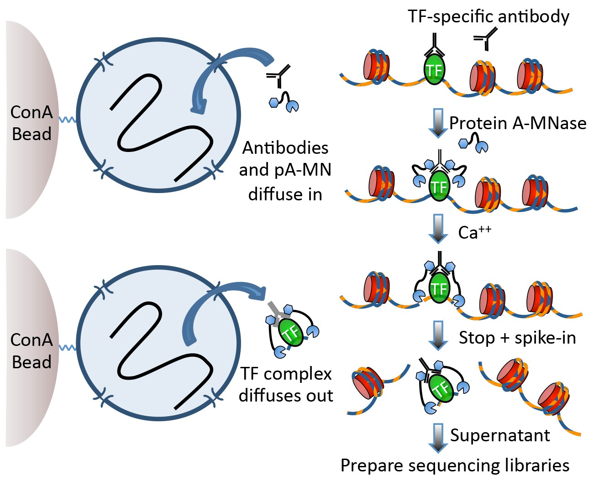
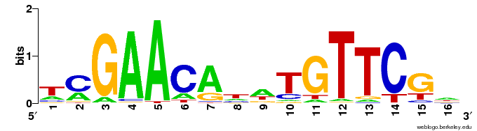

# Where do transcription factors bind in the genome?

Today we'll look at where two yeast transcription factors bind in the genome using CUT&RUN.

Techniques like CUT&RUN require an affinity reagent (e.g., an antibody) that uniquely recognizes a transcription factor in the cell.

This antibody is added to permeabilized cells, and the antibody associates with the epitope. A separate reagent, a fusion of Protein A (which binds IgG) and micrococcal nuclease (MNase) then associates with the antibody. Addition of calcium activates MNase, and nearby DNA is digested. These DNA fragments are then isolated and sequenced to identify sites of TF association in the genome.



## Data download and pre-processing

CUT&RUN data were downloaded from the [NCBI GEO page](https://www.ncbi.nlm.nih.gov/geo/query/acc.cgi?acc=GSE84474) for Skene et al.

I selected the 16 second time point for *S. cerevisiae* Abf1 and Reb1 (note the paper combined data from the 1-32 second time points).

BED files containing mapped DNA fragments were separated by size and converted to bigWig with:

``` bash
# separate fragments by size
awk '($3 - $2 <= 120)' Abf1.bed > CutRun_Abf1_lt120.bed
awk '($3 - $2 => 150)' Abf1.bed > CutRun_Abf1_gt150.bed

# for each file with the different sizes
bedtools genomecov -i Abf1.bed -g sacCer3.chrom.sizes -bg > Abf1.bg
bedGraphToBigWig Abf1.bg sacCer3.chrom.sizes Abf1.bw
```

The bigWig files are available here in the `data/` directory.

### Questions

1.  How do you ensure your antibody recognizes what you think it recognizes? What are important controls for ensuring it recognizes a specific epitope?

2.  What are some good controls for CUT&RUN experiments?

# CUT&RUN analysis

```{r}
#| label: load-libs
#| message: false
library(tidyverse)
library(here)
library(valr)

# genome viz
library(TxDb.Scerevisiae.UCSC.sacCer3.sgdGene)
library(Gviz)
library(rtracklayer)

# motif discovery and viz
library(BSgenome.Scerevisiae.UCSC.sacCer3)
library(memes)
library(universalmotif)
```

## Examine genome coverage

```{r}
#| label: make-tracks
track_start <- 90000
track_end <- 150000

# genes track
sgd_genes_trk <-
  GeneRegionTrack(
    TxDb.Scerevisiae.UCSC.sacCer3.sgdGene,
    chromosome = "chrII",
    start = track_start,
    end = track_end,
    background.title = "white",
    col.title = "black",
    fontsize = 16
  )

# signal tracks
track_info <-
  tibble(
    file_name = c(
      "CutRun_Reb1_lt120.bw",
      "CutRun_Abf1_lt120.bw",
      "CutRun_Reb1_gt150.bw",
      "CutRun_Abf1_gt150.bw"
    ),
    sample_type = c(
      "Reb1_Short",
      "Abf1_Short",
      "Reb1_Long",
      "Abf1_Long"
    )
  ) |>
  mutate(
    file_path = here("data/block-dna", file_name),
    big_wig = purrr::map(
      file_path,
      ~ import.bw(.x, as = "GRanges")
    ),
    data_track = purrr::map2(
      big_wig,
      sample_type,
      ~ DataTrack(
        .x,
        name = .y,
        background.title = "white",
        col.title = "black",
        col.axis = "black",
        fontsize = 16
      )
    )
  ) |>
  dplyr::select(sample_type, big_wig, data_track)

# x-axis track
x_axis_trk <- GenomeAxisTrack(
  col = "black",
  col.axis = "black",
  fontsize = 16
)
```

Now that we have tracks loaded, we can make a plot.

```{r}
#| label: plot-tracks
plotTracks(
  c(
    sgd_genes_trk,
    track_info$data_track,
    x_axis_trk
  ),
  from = track_start,
  to = track_end,
  chromosome = "chrII",
  transcriptAnnotation = "gene",
  shape = "arrow",
  type = "histogram"
)
```

### Questions

1.  What features stand out in the above tracks? What is different between Reb1 and Abf1? Between the short and long fragments?

2.  Where are the major signals with respect to genes?

## Peak calling

A conceptually simple approach to identification of regions containing "peaks" where a transcription factor was bound is available in the MACS software ([paper](), [github]()). There's also a nice [blog post](https://hbctraining.github.io/Intro-to-ChIPseq/lessons/05_peak_calling_macs.html) covering the main ideas.

### Theory

The Poisson distribution is a discrete probability distribution of the form:

$$ P_\lambda (X=k) = \frac{ \lambda^k }{ k! * e^{-\lambda} } $$

where $\lambda$ captures both the mean and variance of the distribution.

The R functions `dpois()`, `ppois()`, and `rpois()` provide access to the density, distribution, and random generation for the Poisson distribution. See `?dpois` for details.

```{r}
#| label: plot-poisson
#| echo: false
#| message: false
#| fig.alt: "Poisson probability density against k for lambda values of 1, 4, and 10, shown as colored points connected by lines."
library(cowplot)
library(ggtext)

crossing(
  k = 1:20,
  lambda = c(1, 4, 10)
) |>
  mutate(p = dpois(k, lambda)) |>
  ggplot(
    aes(factor(k), p, color = factor(lambda), group = lambda)
  ) +
  geom_point(size = 3, alpha = 0.6) +
  geom_line() +
  theme_cowplot() +
  scale_color_brewer(palette = "Set1") +
  labs(x = "k", y = "Density", color = "&lambda;") +
  theme(
    legend.position = "top",
    legend.title = element_markdown()
  )
```

### Practice

Here, we model read coverage using the Poisson distribution. Given some genome size $G$ and and a number of reads collected $N$, we can approximate $\lambda$ from $N/G$.

MACS uses this value (the "genomewide" lambda) and also calculates several "local" lambda values to account for variation among genomic regions. We'll just use the genomewide lambda, which provides a conservative threshold for peak calling.

Using the genomewide lambda, we can use the Poisson distribution to address the question: **How surprised should I be to see** $k$ reads at position X?

```{r}
#| label: peak-calling
abf1_tbl <- read_bigwig(here("data/block-dna/CutRun_Abf1_lt120.bw"))

# number of reads in the original Abf1 BED file
total_reads <- 16e6

genome <- read_genome(here("data/block-dna/sacCer3.chrom.sizes"))
genome_size <- sum(genome$size)

genome_lambda <- total_reads / genome_size

peak_calls <-
  abf1_tbl |>
  # define single-base sites
  mutate(
    midpoint = start + round((end - start) / 2),
    start = midpoint,
    end = start + 1,
    # use the poisson to calculate a p-value with the genome-wide lambda
    pval = dpois(value, genome_lambda),
    # convert p-values to FDR
    fdr = p.adjust(pval, method = "fdr")
  )
```

Let's take a look at a plot of the p-value across a chromosome. What do you notice about this plot, when compared to the coverage of the CUT&RUN coverage above?

```{r}
#| fig.alt: "Line plot of negative log10 Poisson p-values across a region of chromosome II."
ggplot(
  filter(peak_calls, chrom == "chrII"),
  aes(start, -log10(pval))
) +
  geom_line() +
  xlim(track_start, track_end) +
  theme_cowplot()
```

How many peaks are called in this region?

```{r}
#| label: n-peaks
# most stringent cut-off
peak_calls_sig <-
  filter(
    peak_calls,
    fdr == 0
  ) |>
  # collapse neighboring, significant sites
  bed_merge(max_dist = 20) |>
  # drop narrow "spike" intervals that are too short for motif discovery
  # (and likely aren't real binding sites)
  filter(end - start >= 10)

filter(
  peak_calls_sig,
  chrom == "chrII" &
    start >= track_start &
    end <= track_end
)
```

Let's visualize these peaks in the context of genomic CUT&RUN signal. We need to define an `AnnotationTrack` with the peak intervals, which we can plot against the CUT&RUN coverage we defined above.

```{r}
#| label: plot-peaks
# need a GRanges object to convert to an AnnotationTrack
peak_calls_gr <-
  GRanges(
    seqnames = peak_calls_sig$chrom,
    ranges = IRanges(peak_calls_sig$start, peak_calls_sig$end)
  )

peak_calls_trk <-
  AnnotationTrack(
    peak_calls_gr,
    name = "Peak calls",
    fill = "red",
    background.title = "white",
    col.title = "red",
    fontsize = 16,
    rotation.title = 0
  )

abf1_short_trk <-
  filter(
    track_info,
    sample_type == "Abf1_Short"
  ) |>
  pull(data_track)

plotTracks(
  c(
    sgd_genes_trk,
    abf1_short_trk,
    peak_calls_trk,
    x_axis_trk
  ),
  from = track_start,
  to = track_end,
  chromosome = "chrII",
  transcriptAnnotation = "gene",
  shape = "arrow",
  type = "histogram"
)
```

### Questions

1.  How many peaks were called throughout the genome? How wide are the called peaks, on average?

2.  How else might we define a significance threshold for identifying peaks?

3.  What might the relative heights of the peaks indicate? What types of technical or biological variables might influence peak heights?

## Motif discovery

### Theory

There are two major approaches to defining sequence motifs enriched in a sample: enumerative and probabilistic approaches.

Here we'll apply a probabilistic approach (MEME) to discover motifs in a collection of DNA sequences. During the RNA block, you'll learn about k-mer analysis, which is a form of enumerative approach.

In each case, the goal is to define a set of sequence motifs that are encriched in a set of provided sequences (i.e., peaks from CUT&RUN data) relative to a genomic background.

Motifs are expressed in a [Position Weight Matrix](https://en.wikipedia.org/wiki/Position_weight_matrix), which captures the propensities for a position to be a particular nucleotide in a sequence motif.

These PWMs can be represented as sequence logos, visually represent the amount of information provided by the motif, typically using "information content", expressed in bits.



### Practice

We'll use the [memes](https://bioconductor.org/packages/release/bioc/html/memes.html) and [universalmotif](https://bioconductor.org/packages/release/bioc/html/universalmotif.html) packages from Bioconductor to derive sequence motifs from the peaks we called above.

Note: MEME (the underlying motif discovery software) isn't installed in this environment, so this step was run ahead of time on a server where it is. The output is provided for you to import.

1.  Collect the DNA sequences within the peak windows using the BSgenome for *S. cerevisiae*
2.  Provide those sequences to `memes::runMeme()` (run ahead of time here), which uses an Expectation-Maximization (EM) approach to identify and refine motifs.
3.  Import the pre-computed output with `universalmotif::read_meme()`, and examine the discovered motifs.
4.  Plot the top motif as a logo using `universalmotif::view_motifs()`.

```{r}
#| label: motif-discovery
peak_seqs <- BSgenome::getSeq(
  # provided by BSgenome.Scerevisiae.UCSC.sacCer3
  Scerevisiae,
  peak_calls_gr
)

names(peak_seqs) <- as.character(peak_calls_gr)
Biostrings::writeXStringSet(peak_seqs, here("data/block-dna/abf1_peaks.fasta"))

# MEME Suite is not installed in this environment, so this step was run
# ahead of time on a server where it is installed. This is the command
# that was used to generate the motifs (not run here):
#
# meme_results <- memes::runMeme(
#   peak_seqs,
#   outdir = "meme_out",
#   nmotifs = 5,
#   minw = 6,
#   maxw = 20
# )

# import the pre-computed MEME output provided for this exercise
meme_motifs <- universalmotif::read_meme(
  here("data/block-dna/abf1_meme_out/meme.txt")
)

# read_meme() returns a single motif object (not a list) when there's only
# one motif -- normalize to a list either way
if (!is.list(meme_motifs)) meme_motifs <- list(meme_motifs)

# convert to a data frame for easy inspection (sorted by significance)
meme_df <- universalmotif::to_df(meme_motifs)

# look at the consensus motifs
meme_df$consensus

# how many sites support each motif?
meme_df$nsites
```

Now let's look at the sequence logo for the top hit.

```{r}
#| label: plot-logo
# meme_df is sorted by significance, so the first row is the top hit
top_motif <- meme_df$motif[[1]]

universalmotif::view_motifs(top_motif)
```

### Questions

1.  Does this motif make sense, based on what you know about the requirements and specificity of DNA binding by transcription factors?

2.  How might you confirm that a specific sequence (that conforms to a motif) is bound directly by a transcription factor?

## References

Bailey TL, Elkan C. Fitting a mixture model by expectation maximization to discover motifs in biopolymers. Proc Int Conf Intell Syst Mol Biol 1994 \[[PubMed](https://pubmed.ncbi.nlm.nih.gov/7584402/)\] \[[MEME Suite](https://meme-suite.org/meme/doc/meme.html)\]
