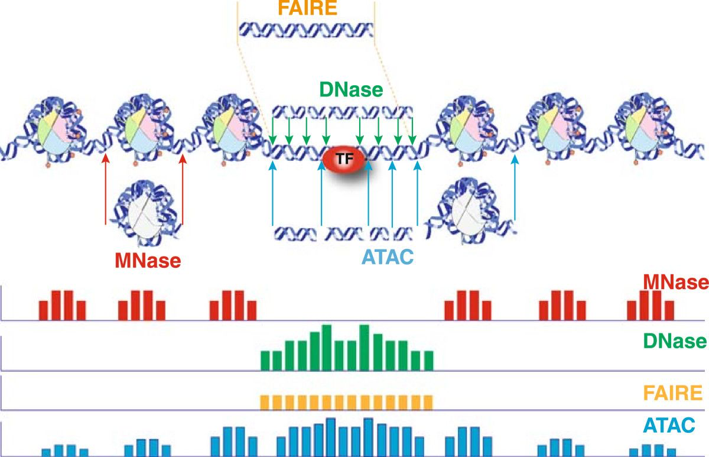

# Chromatin accessibility {#dna-chip}

We will cover different experimental techniques to study chromatin accesibility, how they relate to each other, their biological implications, and important data analysis considerations (figure from https://doi.org/10.1186/1756-8935-7-33).  

```{r fig.width=6, fig.height=4, fig.align='center', echo=FALSE}

```
