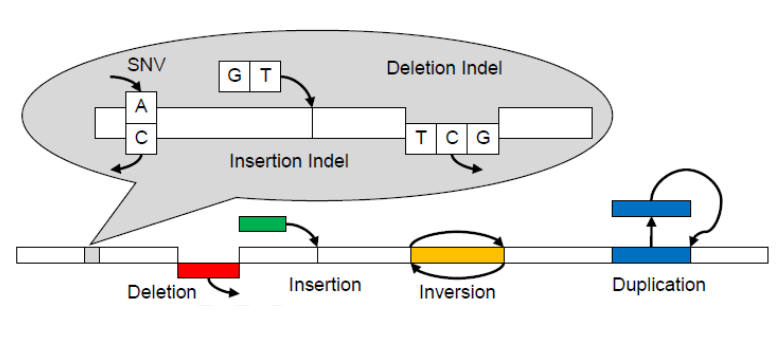

# Syllabus {#syllabus}

## Course Overview

Informatics and Statistics for Molecular Biology (MOLB 7950) teaches students to design and analyze experiments commonly used in molecular biology. The course is organized around the Central Dogma (DNA > RNA > Protein) wherein each block presents 2-3 experimental approaches. Each week, a new experiment is introduced with a discussion of appropriate design and statistical considerations. The remaining weeks' classes are devoted to digging into the analysis of a sample data set with hands-on programming.

### Learning Objectives

- Cater to students of many backgrounds (more computational or more biological)
- Be able to formulate questions that are testable with computational techniques
- Understand the limitations of sequencing-based techniques
- Be fluent in statistical considerations for different approaches and design well-controlled experiments that can be analyzed using statistical tests
- Be fluent in command-line programming, scripting (Python) and data analysis / viz (R / R Studio)
- Understand the value of internet-based analysis tools (NCBI BLAST etc)
- Use reproducible software development approaches (Github) and dynamic documents (Rmarkdown)
- Independently conceive of and implement a soup to nuts reanalysis of an existing data set, which are presented to the class.

### Location

Classes are held in the Health Science Libary in Teaching Lab 2.

<iframe src="https://www.google.com/maps/embed?pb=!1m18!1m12!1m3!1d522.3036530801571!2d-104.83760147806905!3d39.746845026837306!2m3!1f0!2f0!3f0!3m2!1i1024!2i768!4f13.1!3m3!1m2!1s0x876c634e33da2401%3A0x17aa3fee1c687c49!2sUniversity+of+Colorado+Strauss+Health+Sciences+Library!5e0!3m2!1sen!2sus!4v1557762606921!5m2!1sen!2sus" width="600" height="450" frameborder="0" style="border:0" allowfullscreen></iframe>

### Schedule

```{r class_schedule, echo=FALSE, message=FALSE, warning=FALSE}
library(tidyverse)
library(gt)

date_start <- "2019-09-02"
date_end <- "2019-12-10"

sched <- tribble(
  ~ date,       ~ block,    ~ topic,    ~ type, ~ due,
  "2019-08-26", "Bootcamp", "Shell",    "lab", "", 
  "2019-08-28", "Bootcamp", "Shell",    "lab", "",
  "2019-08-30", "Bootcamp", "Shell",    "lab", "",
  "2019-09-04", "Bootcamp", "R Studio", "lab", "Quiz 1",
  "2019-09-06", "Bootcamp", "R Studio", "lab", "",
  "2019-09-09", "Bootcamp", "R Studio", "lab", "Quiz 2",
  "2019-09-11", "Bootcamp", "Python",   "lab", "",
  "2019-09-13", "Bootcamp", "Python",   "lab", "",
  "2019-09-16", "Bootcamp", "Python",   "lab", "Quiz 3",
  "2019-09-18", "Bootcamp", "Git / Github", "lab", "",
  "2019-09-20", "Bootcamp", "Review", "lab",  "",
  "2019-09-23", "Block 1: DNA", "ChIP-seq", "lecture",  "Quiz 4",
  "2019-09-25", "Block 1: DNA", "ChIP-seq", "lab", "",
  "2019-09-27", "Block 1: DNA", "ChIP-seq", "lab", "",
  "2019-09-30", "Block 1: DNA", "Motif finding", "lecture",  "Quiz 5",
  "2019-10-02", "Block 1: DNA", "Motif finding",  "lab", "",
  "2019-10-04", "Block 1: DNA", "Motif finding",  "lab", "",
  "2019-10-07", "Block 1: DNA", "Variant calling",  "lecture", "Quiz 6",
  "2019-10-09", "Block 1: DNA", "Variant calling",  "lab", "",
  "2019-10-11", "Block 1: DNA", "Variant calling",  "lab", "",
  "2019-10-16", "Block 2: RNA", "qPCR", "lecture/lab",  "Quiz 7",
  "2019-09-18", "Block 2: RNA", "qPCR", "lab", "",
  "2019-10-21", "Block 2: RNA", "RNA-seq", "lecture",  "Quiz 8",
  "2019-10-23", "Block 2: RNA", "RNA-seq",  "lab", "",
  "2019-10-28", "Block 2: RNA", "RNA-protein interactions",  "lecture", "Quiz 9",
  "2019-10-30", "Block 2: RNA", "RNA-protein interactions",  "lab", "",
  "2019-11-01", "Block 2: RNA", "RNA-protein interactions",  "lab", "",
  "2019-11-04", "Block 3: Protein", "Mass spectrometry", "lecture",  "Quiz 10",
  "2019-11-06", "Block 3: Protein", "Mass spectrometry", "lab", "",
  "2019-11-08", "Block 3: Protein", "Mass spectrometry", "lab", "Quiz 11",
  "2019-11-11", "Block 3: Protein", "Densitometry", "lecture",  "",
  "2019-11-13", "Block 3: Protein", "Densitometry",  "lab", "",
  "2019-11-15", "Block 3: Protein", "Densitometry",  "lab", "Quiz 12",
  "2019-11-18", "Block 3: Protein", "Subcellular localization",  "lecture", "",
  "2019-11-20", "Block 3: Protein", "Subcellular localization",  "lab", "",
  "2019-11-22", "Block 3: Protein", "Subcellular localization",  "lab", "Quiz 13"
)

sched %>%
  group_by(block, topic) %>%
  gt() %>%
  tab_header(
    title = "MOLB 7950 Schedule",
    subtitle = glue::glue("{date_start} to {date_end}")
  ) %>%
  fmt_date(
    columns = vars(date),
    date_style = 3
  )
```

## Blocks

### Bootcamp

This 4 week block is designed to get students familiar with and bring them up to speed on using software for shell programming and data analysis with R and Python. We also establish accounts on Github for problem set submission. __In future blocks, students will build upon the statistical and computational foundations they acquire in the bootcamp and combine it with domain-specific knowledge of specific experiment addressing each major step in the central dogma.__

#### Shell programming

Students will become familiar with the operating in the Shell, which is closely related to command-line/terminal. The Shell is a program which runs other programs rather than doing calculations itself. Bash is the default shell on most modern implementations of Unix, Mac, and in most packages that provide Unix-like tools for Windows.

__After this section, students will be able to navigate directories, create an organized directory structure for a project, and install and run software.__
	
#### R Studio

Students will learn to use [Rstudio](https://www.rstudio.com/), which is an integrated development environment that makes it way easier to code in R. Within Rstudio, students will use [Rmarkdown](https://rmarkdown.rstudio.com/) to produce high-quality reports, presentations, and documents in a highly reproducible manner. Students will become fluent in importing, processing, and transforming data using a collection of R packages designed for data science [tidyverse](https://www.tidyverse.org/). 

```{r fig.width=6, fig.height=4, fig.align='center', echo=FALSE}
knitr::include_graphics("img/tidyverse-packages.png")
```

After achieving exellence in basic data handling, students will be introduced to a broad range of commonly used statistical tests and an underlying conceptual framework for deciding the appropriate statistical test. We will emphasize concepts unique to genomic/big data. These statistical concepts and tests will be revisited during applied sections of the course in which specific technology and data are introduced and re-analyzed.

__After this section, students will be able to import, process, transform, visualize data; use statistical tests to analyze basic tabular data; genarate html/pdf reports of their work.__

#### Integration with Git

Modern scientists need to write code as part of their research. This code needs to be documented just as bench experiments need to be logged in a lab notebook. Version control systems like [Git](https://git-scm.com), and online hosting site, [GitHub](https://github.com), are critical tools to address these important issues. These tools allow students to track iterative changes made to their code, revert to a specific previous version, and share their code with the broader scientific community. Altogether these tools are a cornerstone of reproducible research practices that is conveniently integrated within Rstudio and Rmarkdown.

__After this section, students will be able to use git within Rstudio to easily version and share their code. They will be expected to turn in assignments using git in Rstudio.__

#### Python

[Python](https://www.python.org/) is an easy to learn language that combines the flexibility of bash along with the conveniences of higher level languages like R. This useful for solving problems for which software does not exist, which is important for students to learn in order to anticipate unmet needs and data from new technologies/assays. Many tools for the analysis of modern datasets are available as python packages, allowing the incorporation of pre-built analysis tools within custom, made-from-scratch, code. Furthermore, python's suitability as a scripting language makes it a natural fit for APIs of other common analysis tools.  For example, image analysis pipelines can be constructed in [Fiji](https://imagej.net/Jython_Scripting), allowing the batch processing of many files at once.  

__After this section, students will be able to write basic software and scripts that will enable them to derive meaning from the large datasets typical of modern biology.__ 

### DNA

This 3 week section covers specific experiments performed on DNA sequences and the types of molecular insights they can provide. 

#### Chromatin accessibility

We will cover different experimental techniques to study chromatin accesibility, how they relate to each other, their biological implications, and important data analysis considerations (figure from https://doi.org/10.1186/1756-8935-7-33). 

__Statistical/Computational concepts: Poisson distribution and genomic intervals.__

```{r fig.width=6, fig.height=4, fig.align='center', echo=FALSE}
knitr::include_graphics("img/chromatin_accesibility.png")
```

#### Motif finding

Sequence elements determine the specificity of many DNA regulatory mechanisms. We will cover key principles and considerations for the discovery of these regulatory motifs from large sets DNA sequences (figure from Wikipedia).

__Statistical/Computational concepts: Position weight matrices, markov models, foreground vs background sequences, expectation maximization, and gibbs sampling.__

```{r fig.width=6, fig.height=4, fig.align='center', echo=FALSE}
knitr::include_graphics("img/sequence_logo.png")
```

#### Variant Calling

Reliable identification and interprtation of DNA variation is important to advance our understanding of the genetic basis of disease. Here we will cover methods and considerations in calling different types of DNA variants from DNA sequence data (figure from https://doi.org/10.1093/gigascience/gix091). 

__Statistical/Computational concepts: Scripting and binomial distribution.__

```{r fig.width=6, fig.height=4, fig.align='center', echo=FALSE}

```

### RNA

This 3 week section covers specific experiments performed on RNA sequences, protein-RNA interactionsand the types of molecular insights they can provide. 

#### Quantitative PCR

This is one of the most commonly used (and abused) techniques to measure the relative expression levels of specific RNAs. We will cover common pitfalls and important data analysis considerations (figure from Wikipedia).  

__Statistical/Computational concepts: Mean, variance, T-test, and ANOVA models.__

```{r fig.width=6, fig.height=4, fig.align='center', echo=FALSE}
knitr::include_graphics("img/qpcr.png")
```

#### RNA-seq

A major breakthrough in the last decade has been the introduction of RNA-sequencing, which has allowed us to identify and count the sequences of all RNAs in a biological sample. We will cover the basic principles and most common RNA-seq experimental designs and appropriate analysis methods and considerations (figure from Wikipedia).

__Statistical/Computational concepts: Negative binomial distribution and general linear models.__

```{r fig.width=6, fig.height=4, fig.align='center', echo=FALSE}
knitr::include_graphics("img/RNA-Seq.png")
```

#### RNA-protein interaction (CLIP)

RNA-binding proteins (RBPs) regulate each step in the life of an mRNA. This includes key decisions like RNA splicing, translation, and degradation. We will cover methods that identify RBP-RNA interactions and the considerations in analyzing and interpreting these data (figure from Wikipedia). 

__Statistical/Computational concepts: Negative binomial distribution, genomic intervals, and non-parametric tests (Wilcoxon, KS-test).__

```{r fig.width=6, fig.height=4, fig.align='center', echo=FALSE}
knitr::include_graphics("img/CLIP.png")
```

### Protein

This 3 week section covers specific experiments performed on proteins and the types of molecular insights they can provide. 

#### Mass Spectrometry

Mass spectrometry (MS) is a powerful technique used to identify and quantify proteins by analyzing peptides generated from samples. We will cover the principles, variety of methods, and important data analysis considerations of MS experiments (figure from Wikipedia).  

__Statistical/Computational concepts: Negative binomial distribution and general linear models.__

```{r fig.width=6, fig.height=4, fig.align='center', echo=FALSE}
knitr::include_graphics("img/Mass_spectrometry.png")
```

#### Densitometry

A recurrent principle in molecular biology is to seprate molecules by molecular mass using gel electrophoresis, more specifically Western bloting for protein analsis. This is very common and we will cover methods to perform analysis and quantification of these experiments using densitometry methods (figure from Wikipedia).

```{r fig.width=6, fig.height=4, fig.align='center', echo=FALSE}
knitr::include_graphics("img/western.png")
```

#### Immunofluoresence

Determining the precise location of a specific protein either within a cell or organ provides critical insights. We will cover important considerations and common pitfalls for the analysis of protein localization by immunofluoresence experiments (figure from Wikipedia). 

__Statistical/Computational concepts: Segmentation, probability density function, background correction, and model fitting.__

```{r fig.width=6, fig.height=4, fig.align='center', echo=FALSE}
knitr::include_graphics("img/IF.png")
```


## Evaluation

### Assignments

**Papers** Assigned papers for class discussion are required reading. Students will volunteer or be assigned specific papers for which they will be responsible for presenting an ~10-min Introduction, including a broad overview of the biological question at hand, the specific hypothesis (if applicable), and the methods used by the authors, focusing especially on methods not covered in the Core course or not generally familiar to first-year PhD students. The same student will be responsible for putting together a Powerpoint (or other equivalent software) presentation containing all of the main figures from the paper, broken down (if necessary) into slides in which all data are easily visible when projected on a screen. Certain supplemental figures may be included if the student thinks they might be important, but this is generally not expected. The same student will be expected to obtain a laptop computer (or equivalent hardware) and necessary adapter for connecting to the projector in the classroom; course directors can help with these materials. Further details regarding preparation of the presentation will be provided in the Course Overview on Jan. 23rd. The effectiveness of the coordinator’s Introduction will be considered by the faculty when assigning a grade. The degree of preparation and/or understanding of the paper reflected in the other students’ contributions to the discussion of the paper will be considered by the faculty when assigning a grade. 

**Final Project** Major proposals include a Specific Aims page and a 6-page Research Proposal (generally two specific aims, based on any papers or topics from Blocks #1-3). Further details regarding preparation of the major proposals will be provided in the latter part of the course. Completed proposals will be evaluated by the course faculty and other students and discussed on the final class days of the course in a "Mock Study Section" similar to the mini-proposals.

**Basis for Final Grade**  Your grade will be determined by the cumulative scores determined from the quality and quantity of your contributions to the paper discussions, your performance as a coordinator and presenter of figures, the quality of mini-proposals and the 6-page Major Proposal, and performance in the proposal discussion in Blocks #1-3 and final Study Sections in Block #4. For CSD students, you will only need to write the major proposal for CSD7605 (we can discuss this if you would like to write for MB7800), but you must participate in the final study section discussions in both courses.  The grade for the CSD proposal will be accepted for both courses. You are allowed one absence from paper discussion class without penalty.  Additional absence from class will result in a full letter grade reduction, unless each absence is made up by writing a critical review of each paper missed. Further details regarding preparation of the make-up paper review will be provided in the Course Overview on Jan. 23rd. The grading scale is subjective and based on an arbitrary point system.

### Grade Dissemination 

The course directors will provide a current score update periodically through the course so that students are aware of their standing. Course directors will explicitly notify students if their participation has been below expectations and needs to be improved. The goal is for the students to not have to worry about their grades. Final scores will be sent to the students at the end of the semester. 

## Course Policies and Procedures

**Attendance Policy** You are allowed one absence from paper discussion class without penalty. Additional absence from class will result in a full letter grade reduction, unless each absence is made up by writing a critical review of each paper missed. Attendance at mini-proposal discussions and final major proposal discussions is mandatory. Participation is evaluated objectively (number of paper figures presented, number of papers on which the student acted as coordinator, number of questions asked during discussion) and subjectively (quality of contribution to discussion).

**Late Work Policy** Proposals turned in late will be assessed a penalty: a half-letter grade if it is one day late or a full-letter grade for 2-3 days late. Material will not be accepted if greater than 3 days late. Exceptions can be made upon discussion with the course coordinators and considering exceptional circumstances. 

**Extra Credit Policy** No extra credit will be considered. 

**Grades of "Incomplete"** (The current university policy concerning incomplete grades will be followed in this course. Incomplete grades are given only in situations where unexpected emergencies prevent a student from completing the course and the remaining work can be completed the next semester. Your instructors and the Program Directors are the final authorities on whether you qualify for an incomplete. Incomplete work must be finished by the end of the subsequent semester or the “I” will automatically be recorded as an “F” on your transcript. 

**Rewrite/Resubmit Policy** The critical paper reviews required in lieu of class attendance may be returned to the student for a re-write if the course directors and/or block faculty deem them insufficient. 

**Group Work Policy** Students are encouraged to work together to prepare for paper discussions, although this is not necessary. Students are encouraged to share drafts of their mini- and full proposals with other students and faculty prior to submission, although it is expected that if multiple students choose to prepare proposals relating to the same subject or hypothesis, these students should recognize the potential for inappropriate sharing of ideas, and should avoid sharing their work with other such students. Feedback given between students should be general in terms of the science, or specific in terms of writing style/grammar/spelling, but not specific in terms of explicit changes in experimental approaches or hypotheses.

### Technology and Media

**Email** Email and Canvas are expected to be the primary method of communication between faculty and students outside of class, but students are also encouraged to speak directly with faculty after having arranged a time beforehand. Canvas will be the primary method by which course information is disseminated to the students, and the method by which students are expected to submit their assignments.(

**Laptop and Mobile Device Usage** Laptops and tablets are permitted and encouraged in class to facilitate additional searches of the literature during the session.

### Student Expectations

**Civility** Our commitment is to create a climate for learning characterized by respect for each other and the contributions each person makes to class. We ask that you make a similar commitment. Criticism of work written by another student is expected to be constructive and articulated in a manner that is considerate of the effort that all students are expected to put into their work. As class participation during discussions is a crucial component of the grading for this course, students are encouraged to allow others the opportunity to participate, and avoid dominating the discussion. Faculty may intervene if this becomes a problem.

**Professionalism** Mobile devices must be silenced during all classroom meetings. Those not heeding this rule will be asked to leave the classroom/lab immediately so as to not disrupt the learning environment. 

**Electronic Cigarettes (e-cigarettes)** The use of e-cigarettes during all classroom activity is prohibited. Any student who does not comply with this rule will be asked to leave the classroom immediately so as to not disrupt the learning environment. The Anschutz Medical Campus is a tobacco-free campus.

**Late Arrivals** Late arrivals at class disrupt the learning environment. If late arrivals by a student becomes a pattern of behavior, course directors will intervene and may deduct grade points.

**Religious Observances** The course directors request that students inform us as early as possible of conflicts between the normal class schedule and major religious observances, and/or if they intend to miss class to observe a holy day of their religious faith. We will be as accommodating as possible.

### University Policies

**Disability Access** Offer specifics about the university’s policy on disability access. Example:(The University of Colorado Denver is committed to providing reasonable accommodation and access to programs and services to persons with disabilities. Students with disabilities who want academic accommodations must register with Disability Resources and Services (DRS) in North Classroom 2514, Phone: 303-556-3450, TTY: 303-556- 4766, Fax: 303-556-4771. We will be happy to provide approved accommodations, once you provide us with a copy of DRS’s letter. 

**Academic Honesty(Student Code of Conduct** Students are expected to know, understand, and comply with the ethical standards of the university, including rules against plagiarism, cheating, fabrication and falsification, multiple submissions, misuse of academic materials, and complicity in academic dishonesty. Please see the Academic Honesty Handbook at: http://www.ucdenver.edu/faculty_staff/faculty/center-for-faculty-development/Documents/ academic_honesty.pdf for suggestions on ways to avoid academic dishonesty. 

**Plagiarism** Plagiarism is the use of another person’s ideas or words without acknowledgement. The incorporation of another person’s work into yours requires appropriate identification and acknowledgement. Examples of plagiarism when the source is not noted include: word- or-word copying of another person’s ideas or words; the “mosaic” (interspersing your own words here and there while, in essence, copying another’s work); the paraphrase (the rewriting of another’s work, while still using their basic ideas or theories); fabrication (inventing or counterfeiting sources); submission of another’s work as your own; and neglecting quotation marks when including direct quotes, even on material that is otherwise acknowledge. 

**Cheating** Cheating involves the possession, communication, or use of information, materials, notes, study aids, or other devices and rubrics not specifically authorized by the course instructor in any academic exercise, or unauthorized communication with any other person during an academic exercise. Examples of cheating include: copying from another’s work or receiving unauthorized assistance from another; collaborating with another or others without the consent of the instructor; submitting another’s work as one’s own. 

**Fabrication** Fabrication involves inventing or counterfeiting information—creating results not properly obtained through study or laboratory experiment. Falsification involves deliberate alteration or changing of results to suit one’s needs in an experiment or academic exercise. 

**Multiple submissions** Multiple submission involves submitting academic work in a current course when academic credit for the work was previously earned in another course, when such submission is made without the current course instructor’s authorization.

**Misuse of materials** Misuse of academic materials includes: theft/destruction of library or reference materials or computer programs; theft/destruction of another student’s notes or materials; unauthorized possession of another student’s notes or materials; theft/destruction of examinations, papers, or assignments; unauthorized assistance in locating/using sources of information when forbidden or not authorized by the instructor; unauthorized possession, disposition, or use of examinations or answer keys; unauthorized alteration, forgery, fabrication, or falsification of academic records; unauthorized sale or purchase of examinations, papers, or assignments.

**Complicity** Complicity in academic dishonesty involves knowingly contributing to or cooperating with another’s act(s) of academic dishonesty. 

### Important Dates

- [Academic Calendar](http://www.ucdenver.edu/anschutz/studentresources/Registrar/Documents/AcademicCalendars/2019-2020/AcademicCalendar-GradSchool-2019-2020_Fall2019.pdf)
